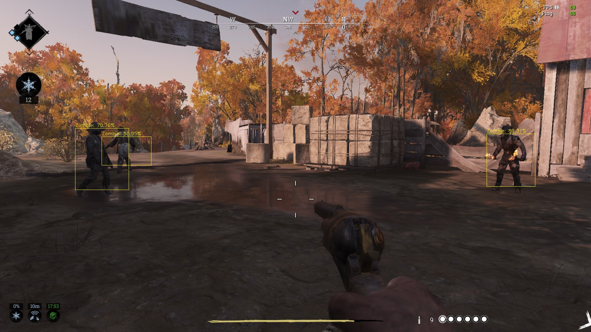

# Realtime-YOLO-Monster-Detection-With-Non-Maximum-Supression
This repository contains detection of 6 monsters, "Zombie","Armored","Immolator","Crowl","Hive","Hellhound" on Crytek game Hunt Showdown. The reason I work on this game is that, I really enjoy playing this game (Even if i have chance to play only 4,5 hours a week) and I think developers and designers of this game are pretty clever. Furthermore, this game has a philosophy, not realy that straightforward as if it is only kill hunters, take the reward and go to exit.
The model is trained with 250 Images and tested with 70 images. Data was obviously imbalanced, since I have been only able to gather 10,15 immolator images. 
The reason I didn't really keen on gathering more images and create a good model is that, It really requires greate computational cost to process Images. Besides training model, also working on it real time have been exhausting for my PC.

## Table of Contents
* 1. Introduction
* 2. Corretly Classified Samples
* 3. Misclassified Samples
* 4. Final Remarks

### 1. Introduction

### 2. Correctly Classified Samples

### 3. Misclassified Samples

### 4. Final Remarks

