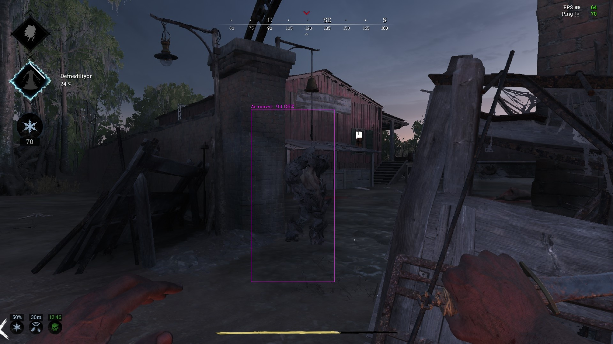
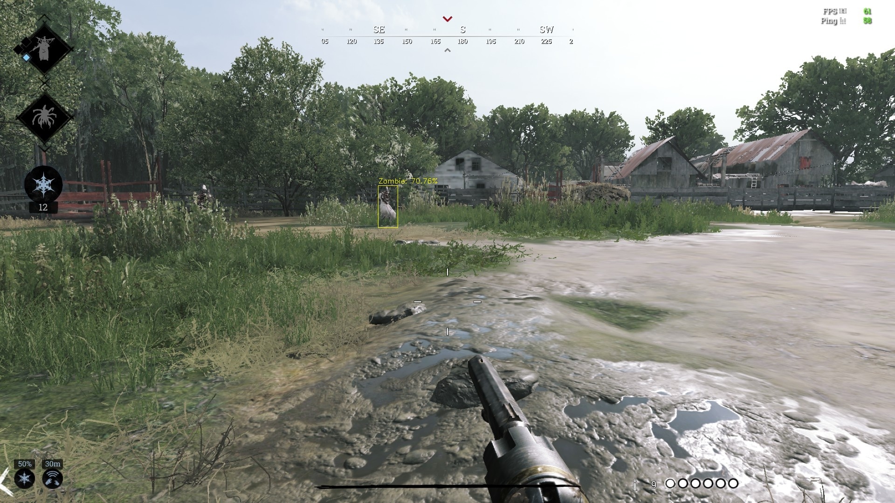

# Realtime-YOLO-Monster-Detection-With-Non-Maximum-Supression

## Table of Contents
1. Introduction
2. Requirements
3. Some of the Corretly Classified Samples
4. Some of the Misclassified Samples
5. Final Remarks

### 1. Introduction

This repository contains detection of 6 monsters, "Zombie","Armored","Immolator","Crowl","Hive","Hellhound" on a Crytek game called Hunt Showdown.

The reason I work on this game is that, I really enjoy playing this game (Even if i don't really have chance to play so often), also I admire developers and designers of this game. This game has a philosophy, not realy that straight forward as if it is only kill hunters, take the reward and go to the exit.

The code is design to test on youtube videos since both it is real time and easy to test.

### 2. Requirements
opencv-python, numpy, and pafy modules are required. If you don't have
1. pip install numpy
2. pip install opencv-python
3. pip install pafy
helps.

### 3. Some of the Correctly Classified Samples

### 4. Some of the Misclassified Samples

### 5. Final Remarks
The model does not perform well enough, since 250 images used for training and 70 for testing. 
It needs to be fed with larger amount of data, especially for immolator label.
But it is OK :)
Enjoy !!
