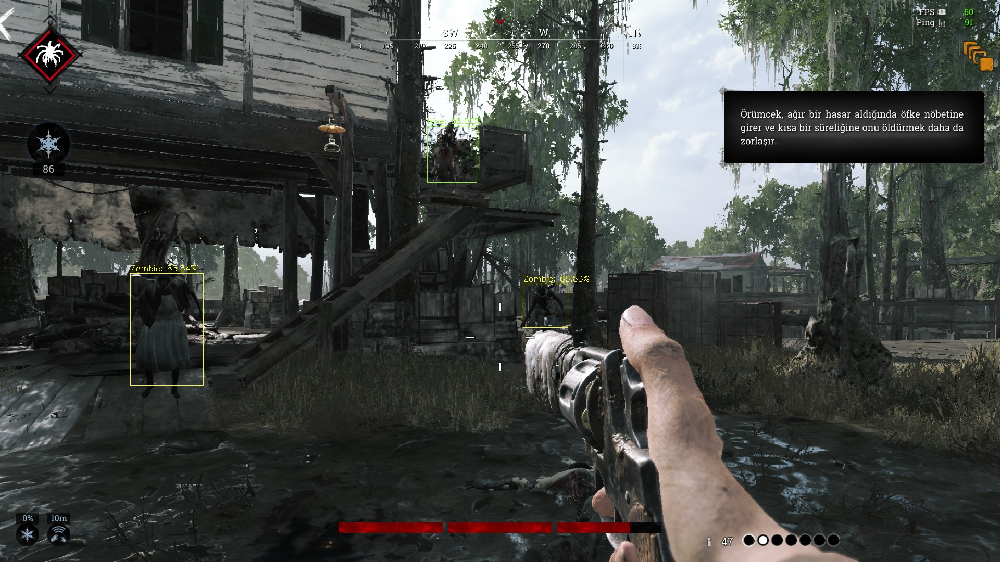
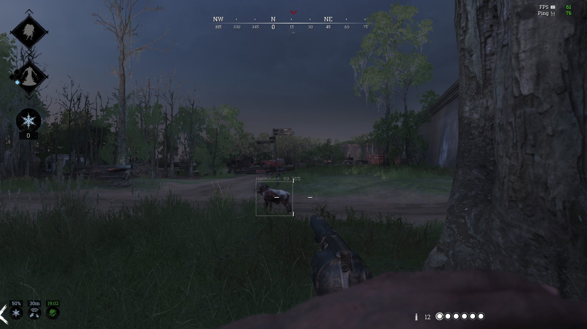

# Realtime-YOLO-Monster-Detection-With-Non-Maximum-Supression

## Table of Contents
1. Introduction
2. Some of the Corretly Classified Samples
3. Some of the Misclassified Samples
4. Final Remarks

### 1. Introduction

This repository contains detection of 6 monsters, "Zombie","Armored","Immolator","Crowl","Hive","Hellhound" on Crytek a game called Hunt Showdown.

The reason I work on this game is that, I really enjoy playing this game (Even if i have chance to play only 4,5 hours a week) and I admire developers and designers of this game. This game has a philosophy, not realy that straightforward as if it is only kill hunters, take the reward and go to the exit.

### 2. Correctly Classified Samples

### 3. Misclassified Samples

### 4. Final Remarks
This model did not work great, obviously. The first reason is that, it is not trained with sufficient amount of data: Besides training the model, also working with a trained model on realtime is really exhaustive since it is working purely on images. 

The second reason is that, the data was imbalanced: Eventhough there exists 6 labels, Zombie images constitutes almost %30 of all the images and really less images gathered for immolator label.

The third reason is that, some images were gathered on daylight, some images were from darker light. Even if no images was made on night map both for trainig or testing, due to nature of the game, the illumination of the game still varies. To avoid this, more images are needed for training.
